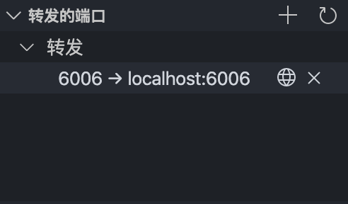

# Tensorboard Service on k8s

## some parameter for Tensorboard

- default log path in the container is `/tmp/logs`
- default container port is `6006` and bind to the NordPort `30022`
- default file system is nfs and specified in the `TBpv.yaml`
- if you want to view page on your own browser, please do ssh forwarding  
    *follow the tutorial below*

## ssh channel (3 ways to forward)

- need to bind jumper-box port

- ssh Local Port Forwarding

  ```bash
  ssh -L <local-host-port>:<taget-server-ip>:<target-port> <jumper-sever-ip-or-dns> -l <user-name>
  ```

- specify in the ssh_config file

- easiest way for vscoder

  - click conputer icon, press '+', enter 6006 and hit enter

  

<!-- TODO: using configMap to config volumes and secrets! -->